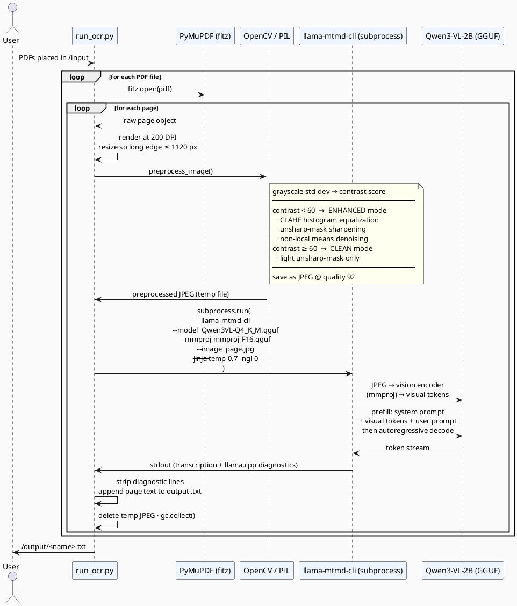

# ClearScan

PDF-to-text OCR for scanned documents — including handwritten text and Swedish characters — powered by a locally-running vision-language model. No API keys, no cloud, no data leaves the machine.

## What It Does

ClearScan takes a folder of scanned PDFs and produces clean `.txt` transcriptions, one file per PDF. It handles:

- Works for both Typewritten and handwritten documents
- Handles Low-contrast, faded, or photographed scans (adaptive image enhancement)
- Keen recognition for Swedish characters: Å Ä Ö å ä ö
- Adds Redacted sections → `[REDACTED]` if text is redacted
- For Unreadable words → `[?]`
- Multi-page PDFs (each page processed independently and appended in order)

**Typical throughput:** ~75–90 s/page on a modern CPU at 4 threads.

---

## How It Works

Each PDF page is processed in two stages: **image preprocessing** then **LLM inference**. A new `llama-mtmd-cli` subprocess is spawned per page to keep memory usage flat across long documents.



### Key design decisions

| Decision | Rationale |
|---|---|
| **One subprocess per page** | Prevents memory accumulation on long documents; each page starts with a fresh heap |
| **CPU-only** (`-ngl 0`) | Runs on any machine — no GPU or driver setup required |
| **Q4_K_M quantization** | 4-bit K-means grouping — best accuracy/size tradeoff for a 2 B model |
| **`/no_think` prefix** | Disables Qwen3 chain-of-thought mode; avoids wasting tokens on reasoning |
| **Presence penalty 1.5** | Suppresses line/paragraph repetition, the most common OCR-prompting failure mode |
| **Adaptive preprocessing** | CLAHE + denoising only when contrast is genuinely low; clean scans go through minimal sharpening only |

---

## Model Dependencies

| Component | HuggingFace source | Size | Role |
|---|---|---|---|
| `Qwen3VL-2B-Instruct-Q4_K_M.gguf` | [Qwen/Qwen3-VL-2B-Instruct-GGUF](https://huggingface.co/Qwen/Qwen3-VL-2B-Instruct-GGUF) | ~1.1 GB | LLM weights (4-bit quantized) |
| `mmproj-Qwen3VL-2B-Instruct-F16.gguf` | [Qwen/Qwen3-VL-2B-Instruct-GGUF](https://huggingface.co/Qwen/Qwen3-VL-2B-Instruct-GGUF) | ~782 MB | Vision encoder / multimodal projector (FP16) |
| `llama-mtmd-cli` binary | [ggml-org/llama.cpp](https://github.com/ggml-org/llama.cpp) release `b8198` | ~4 MB | Inference runtime (multimodal CLI) |

In Docker both GGUFs are baked into the image at build time — no internet access is needed at runtime.

---

## Build & Run — Docker (Recommended)

### Requirements

- Docker Desktop ≥ 4.x (or Docker Engine on Linux)
- ~3 GB free disk for the image
- ~2 GB RAM at runtime

### Build

```bash
docker build -t clearscan .
```

> **First build** fetches models (~1.9 GB) and the llama.cpp binary — allow 10–15 minutes.
> **Subsequent builds** are fast thanks to layer caching.

The Dockerfile is **multi-platform**:
- `linux/amd64` — downloads a pre-built llama.cpp release binary
- `linux/arm64` (Apple Silicon) — compiles llama.cpp from source (~5 extra minutes)

No `--platform` flag required; Docker picks the right path automatically.

### Run

```bash
docker run --rm \
  -v "$(pwd)/data":/input \
  -v "$(pwd)/output":/output \
  clearscan
```

All `.pdf` files in `./data/` are processed; `.txt` results appear in `./output/`.

### Options

```bash
# More threads
docker run --rm \
  -v "$(pwd)/data":/input -v "$(pwd)/output":/output \
  clearscan --threads 8

# Larger context window for dense pages
docker run --rm \
  -v "$(pwd)/data":/input -v "$(pwd)/output":/output \
  clearscan --ctx-size 8192 --max-tokens 2000

# Full help
docker run --rm clearscan --help
```

### Configuration reference

CLI flags override env vars; env vars override built-in defaults.

| Flag | Env variable | Default | Description |
|---|---|---|---|
| `-t, --threads` | `CLEARSCAN_THREADS` | `4` | CPU threads for inference |
| `--ctx-size` | `CLEARSCAN_CTX_SIZE` | `4096` | Context window (tokens) |
| `--max-tokens` | `CLEARSCAN_MAX_TOKENS` | `1500` | Max output tokens per page |
| `--temp` | `CLEARSCAN_TEMP` | `0.7` | Sampling temperature |

```bash
# Via environment variables
docker run --rm \
  -e CLEARSCAN_THREADS=8 \
  -e CLEARSCAN_CTX_SIZE=8192 \
  -v "$(pwd)/data":/input \
  -v "$(pwd)/output":/output \
  clearscan
```

### Image details

| | |
|---|---|
| Base image | `python:3.11-slim` |
| Compressed size | ~2.5 GB |
| Platforms | `linux/amd64`, `linux/arm64` |
| llama.cpp | pinned to release `b8198` |
| Models | baked in at build time |

---

## Build & Run — Local (Without Docker)

### Prerequisites

- Python 3.10+
- ~2 GB free disk for models
- ~2 GB RAM at runtime

### 1. Install Python dependencies

```bash
git clone <repo-url> && cd ClearScan
python -m venv .venv
source .venv/bin/activate        # Windows: .venv\Scripts\activate
pip install --upgrade pip
pip install -r requirements.txt
```

### 2. Get the llama.cpp binary

Download the pre-built binary for your platform from the [b8198 release](https://github.com/ggml-org/llama.cpp/releases/tag/b8198):

| Platform | Download |
|---|---|
| Linux x86_64 | `llama-b8198-bin-ubuntu-x64.tar.gz` |
| Windows x64 | `llama-b8198-bin-win-x64.zip` |
| macOS Apple Silicon | Build from source (below) |

Extract into `llama_bin/` at the project root so the layout looks like:

```
ClearScan/
└── llama_bin/
    ├── llama-mtmd-cli      ← llama-mtmd-cli.exe on Windows
    ├── libllama.so         ← .dll / .dylib on other platforms
    └── libggml.so
```

**macOS Apple Silicon — compile from source:**

```bash
git clone --depth 1 --branch b8198 https://github.com/ggml-org/llama.cpp.git
cmake -S llama.cpp -B llama.cpp/build \
  -DCMAKE_BUILD_TYPE=Release -DGGML_OPENMP=ON -DBUILD_SHARED_LIBS=ON
cmake --build llama.cpp/build --target llama-mtmd-cli -j$(sysctl -n hw.logicalcpu)
mkdir -p llama_bin
cp llama.cpp/build/bin/llama-mtmd-cli llama_bin/
cp llama.cpp/build/src/*.dylib       llama_bin/ 2>/dev/null || true
cp llama.cpp/build/ggml/src/*.dylib  llama_bin/ 2>/dev/null || true
```

### 3. Download models

```bash
python download_model.py
```

Fetches both GGUFs (~1.9 GB) from HuggingFace into `models/`:

```
models/
├── Qwen3VL-2B-Instruct-Q4_K_M.gguf       (~1.1 GB)
└── mmproj-Qwen3VL-2B-Instruct-F16.gguf   (~782 MB)
```

### 4. Run

```bash
python run_ocr.py                              # data/ → output/
python run_ocr.py --input /path/to/pdfs \
                  --output /path/to/results    # custom paths
python run_ocr.py --threads 8 --ctx-size 8192  # tuning
python run_ocr.py --help                       # all options
```

---

## Output Format

Each PDF produces a `.txt` file:

```
OCR OUTPUT: document.pdf
Model    : Qwen3-VL-2B (Q4_K_M GGUF)
Started  : 2026-03-05 10:00:00
Settings : ctx=4096, temp=0.7, presence_penalty=1.5, jinja=ON, no_think=ON, max_size=1120px
============================================================

--- PAGE 1/10  [92.7s | ENHANCED | c=44] ---
<transcribed text>

--- PAGE 2/10  [74.4s | CLEAN | c=88] ---
<transcribed text>

============================================================
Completed : 2026-03-05 10:22:00
Pages     : 10  (errors: 0)
Total time: 22.1 minutes
```

`ENHANCED` / `CLEAN` — preprocessing mode applied. `c=` — grayscale standard deviation of the raw scan (contrast proxy).

---

## Python Dependencies

| Package | Version | Role |
|---|---|---|
| `PyMuPDF` | 1.27.1 | PDF → raster image via fitz |
| `opencv-python-headless` | 4.13.0 | CLAHE, denoising, sharpening |
| `Pillow` | 12.1.1 | Image I/O and resize |
| `numpy` | 2.2.6 | Pixel array operations |
| `huggingface_hub` | 1.5.0 | Model file downloads |
| `hf_transfer` | 0.1.9 | Fast parallel HuggingFace downloads |

Full pinned dependency list in [requirements.txt](requirements.txt).

