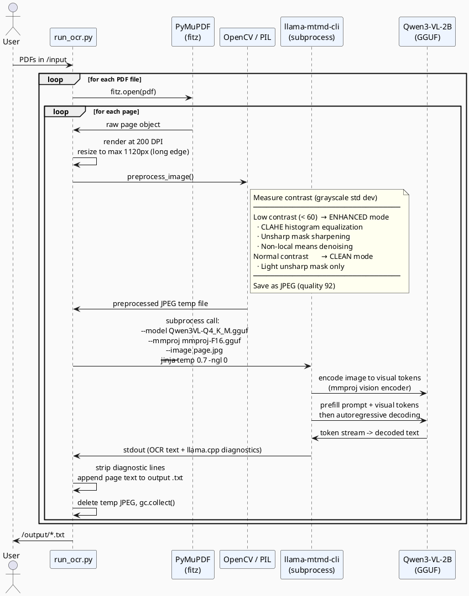

# ClearScan

PDF-to-text OCR for scanned documents — including handwritten text and Swedish characters — powered by **Qwen3-VL-2B**, a locally-running vision-language model via **llama.cpp**.

## Overview

ClearScan takes a directory of scanned PDF files and produces clean plain-text transcriptions. It handles:

- Handles both Typewritten and handwritten documents
- Low-contrast, faded, or degraded scans (adaptive preprocessing)
- Swedish characters: Å Ä Ö å ä ö
- Redacted sections (outputs `[REDACTED]`)
- Unreadable words (outputs `[?]`)
- Multi-page PDFs (each page is processed independently)

**Typical throughput:** ~75–90 seconds per page on a modern CPU (4 threads).

---

## How It Works

Each PDF page goes through two stages: **image preprocessing** then **LLM inference**.



### Key design decisions

| Decision | Rationale |
|---|---|
| **One subprocess per page** | Prevents memory accumulation across many pages; each page starts with a clean process |
| **CPU-only inference** (`-ngl 0`) | Works on any machine; no GPU required |
| **Q4_K_M quantization** | Best accuracy-to-size tradeoff for a 2B model; 4-bit with K-means grouping |
| **`/no_think` system prompt** | Disables Qwen3's chain-of-thought mode, avoiding token waste on reasoning |
| **Presence penalty 1.5** | Suppresses line/paragraph repetition — a common failure mode in OCR prompting |
| **Adaptive preprocessing** | CLAHE + denoising applied only when contrast is genuinely degraded, preserving quality on clean scans |

---

## Model Dependencies

| Component | Source | Size | Purpose |
|---|---|---|---|
| `Qwen3VL-2B-Instruct-Q4_K_M.gguf` | [Qwen/Qwen3-VL-2B-Instruct-GGUF](https://huggingface.co/Qwen/Qwen3-VL-2B-Instruct-GGUF) | ~1.1 GB | LLM weights (Q4_K_M 4-bit quantization) |
| `mmproj-Qwen3VL-2B-Instruct-F16.gguf` | [Qwen/Qwen3-VL-2B-Instruct-GGUF](https://huggingface.co/Qwen/Qwen3-VL-2B-Instruct-GGUF) | ~782 MB | Vision encoder (multimodal projector, FP16) |
| `llama-mtmd-cli` | [ggml-org/llama.cpp](https://github.com/ggml-org/llama.cpp) release `b8198` | ~4 MB | Inference runtime (multimodal CLI) |

In Docker, both GGUF files are baked into the image at build time. In local setup, `download_model.py` fetches them from HuggingFace.

---

## Quick Start — Docker (Recommended)

No Python setup required. Models are bundled in the image.

### Requirements

- Docker Desktop ≥ 4.x (or Docker Engine on Linux)
- ~3 GB free disk space
- ~2 GB RAM available at runtime

### Build

```bash
docker build -t clearscan .
```

> **First build** downloads both GGUF model files (~1.9 GB total) and the llama.cpp binary. Allow 10–15 minutes.
> **Subsequent builds** use Docker layer cache — typically under 1 minute.

The Dockerfile is **multi-platform**:
- `linux/amd64` — downloads a pre-built llama.cpp binary from the GitHub release
- `linux/arm64` (Apple Silicon) — compiles llama.cpp from source during build (~5 extra minutes)

No `--platform` flag needed; Docker selects the correct path automatically.

### Run

```bash
docker run --rm \
  -v "$(pwd)/data":/input \
  -v "$(pwd)/output":/output \
  clearscan
```

Put your PDFs in `./data/` beforehand. Results are written to `./output/` as `.txt` files.

### Tuning options

```bash
# More threads for faster inference
docker run --rm \
  -v "$(pwd)/data":/input \
  -v "$(pwd)/output":/output \
  clearscan --threads 8

# Larger context window (needed for very dense pages)
docker run --rm \
  -v "$(pwd)/data":/input \
  -v "$(pwd)/output":/output \
  clearscan --ctx-size 8192 --max-tokens 2000

# See all options
docker run --rm clearscan --help
```

### Configuration reference

Flags take precedence over environment variables; environment variables take precedence over built-in defaults.

| Flag | Env variable | Default | Description |
|---|---|---|---|
| `-t, --threads` | `CLEARSCAN_THREADS` | `4` | CPU threads for llama.cpp inference |
| `--ctx-size` | `CLEARSCAN_CTX_SIZE` | `4096` | Context window in tokens |
| `--max-tokens` | `CLEARSCAN_MAX_TOKENS` | `1500` | Max output tokens per page |
| `--temp` | `CLEARSCAN_TEMP` | `0.7` | Sampling temperature |

```bash
# Using environment variables instead of flags
docker run --rm \
  -e CLEARSCAN_THREADS=8 \
  -e CLEARSCAN_CTX_SIZE=8192 \
  -v "$(pwd)/data":/input \
  -v "$(pwd)/output":/output \
  clearscan
```

### Image details

- **Base:** `python:3.11-slim`
- **Size:** ~2.5 GB
- **Platforms:** `linux/amd64`, `linux/arm64`
- **llama.cpp:** pinned to release `b8198`
- **Models:** baked in at build time — no network access needed at runtime

---

## Local Setup (Without Docker)

### Prerequisites

- Python 3.10+
- ~2 GB free disk space for models
- ~2 GB RAM at runtime

### 1. Create environment and install dependencies

```bash
git clone <repo-url> && cd ClearScan
python -m venv .venv
source .venv/bin/activate        # Windows: .venv\Scripts\activate
pip install --upgrade pip
pip install -r requirements.txt
```

### 2. Download the llama.cpp binary

Get the pre-built binary for your platform from the [llama.cpp b8198 release](https://github.com/ggml-org/llama.cpp/releases/tag/b8198):

| Platform | File to download |
|---|---|
| Linux x86_64 | `llama-b8198-bin-ubuntu-x64.tar.gz` |
| Windows x64 | `llama-b8198-bin-win-x64.zip` |
| macOS Apple Silicon | Build from source (see below) |

Extract into `llama_bin/` inside the project root:

```
ClearScan/
└── llama_bin/
    ├── llama-mtmd-cli        # llama-mtmd-cli.exe on Windows
    ├── libllama.so           # .dll on Windows, .dylib on macOS
    ├── libggml.so
    └── ...
```

**macOS Apple Silicon — build from source:**

```bash
git clone --depth 1 --branch b8198 https://github.com/ggml-org/llama.cpp.git
cmake -S llama.cpp -B llama.cpp/build \
  -DCMAKE_BUILD_TYPE=Release \
  -DGGML_OPENMP=ON \
  -DBUILD_SHARED_LIBS=ON
cmake --build llama.cpp/build --target llama-mtmd-cli -j$(sysctl -n hw.logicalcpu)
mkdir -p llama_bin
cp llama.cpp/build/bin/llama-mtmd-cli llama_bin/
cp llama.cpp/build/src/*.dylib llama_bin/ 2>/dev/null
cp llama.cpp/build/ggml/src/*.dylib llama_bin/ 2>/dev/null
```

### 3. Download the model files

```bash
python download_model.py
```

Downloads both GGUF files (~1.9 GB total) from HuggingFace into `models/`:

```
models/
├── Qwen3VL-2B-Instruct-Q4_K_M.gguf       (~1.1 GB)
└── mmproj-Qwen3VL-2B-Instruct-F16.gguf   (~782 MB)
```

### 4. Run

```bash
# Reads from data/, writes to output/
python run_ocr.py

# Custom input/output directories
python run_ocr.py --input /path/to/pdfs --output /path/to/results

# Tune performance
python run_ocr.py --threads 8 --ctx-size 8192 --max-tokens 2000

# All options
python run_ocr.py --help
```

---

## Output Format

Each PDF produces a `.txt` file with this structure:

```
OCR OUTPUT: document.pdf
Model    : Qwen3-VL-2B (Q4_K_M GGUF)
Started  : 2026-03-05 10:00:00
Settings : ctx=4096, temp=0.7, presence_penalty=1.5, jinja=ON, no_think=ON, max_size=1120px
============================================================

--- PAGE 1/10  [92.7s | ENHANCED | c=44] ---
<transcribed text for page 1>

--- PAGE 2/10  [74.4s | CLEAN | c=88] ---
<transcribed text for page 2>

============================================================
Completed : 2026-03-05 10:22:00
Pages     : 10  (errors: 0)
Total time: 22.1 minutes
```

`ENHANCED` / `CLEAN` is the preprocessing mode. `c=` is the measured contrast (grayscale standard deviation) of the raw scan.

---

## Python Dependencies

Key runtime packages (pinned versions in `requirements.txt`):

| Package | Version | Role |
|---|---|---|
| `PyMuPDF` | 1.27.1 | PDF rendering to raster images |
| `opencv-python-headless` | 4.13.0 | CLAHE, denoising, sharpening |
| `Pillow` | 12.1.1 | Image I/O and resize |
| `numpy` | 2.2.6 | Pixel array operations |
| `huggingface_hub` | 1.5.0 | Model file downloads |
| `hf_transfer` | 0.1.9 | Fast parallel downloads from HuggingFace |

```bash
# Go to your main project folder
cd path/to/your/project_folder

# Create a completely separate folder for this model test
mkdir qwen3vl_test
cd qwen3vl_test

# Create subfolders
mkdir data output models
```

Your structure:
```
project_folder/
├── (your existing paddle code)
├── nanonets_test/         ← previous test
└── qwen3vl_test/
    ├── data/              ← put your test PDFs here
    ├── output/            ← text results will appear here
    └── models/            ← GGUF weights download here
```

---

### STEP 2 — Create the Virtual Environment

```bash
python -m venv venv_qwen3vl
```

Activate it:

**Windows:**
```bash
venv_qwen3vl\Scripts\activate
```

**Linux/Mac:**
```bash
source venv_qwen3vl/bin/activate
```

You should see `(venv_qwen3vl)` in your terminal.

---

### STEP 3 — Upgrade pip

```bash
python -m pip install --upgrade pip
```

---

### STEP 4 — Install Python Dependencies

```bash
# PDF processing
pip install pymupdf
pip install Pillow
pip install numpy

# Model download utility
pip install huggingface_hub hf_transfer
```

---
**On Windows**

STEP 1 — Download the Pre-Built llama.cpp Windows Binary
Go to this URL in your browser:
https://github.com/ggml-org/llama.cpp/releases/latest
Look for a file named something like:
llama-...-x64.zip
Download that zip. 
Extract it. You will get a folder with many .exe and .dll files inside. Copy that entire extracted folder into your qwen3vl_test/ directory and rename it llama_bin


---

### STEP 6 — Download the GGUF Model Files

Create a file called `download_model.py` inside `qwen3vl_test/` and run it:

```python
import os
os.environ["HF_HUB_ENABLE_HF_TRANSFER"] = "1"
from huggingface_hub import hf_hub_download

print("Downloading Qwen3-VL-2B GGUF files...")
print("Total download: ~1.6GB\n")

# Download the quantized LLM weights (~1.3GB)
print("Downloading LLM weights (Q4_K_M ~1.3GB)...")
hf_hub_download(
    repo_id="Qwen/Qwen3-VL-2B-Instruct-GGUF",
    filename="Qwen3VL-2B-Instruct-Q4_K_M.gguf",
    local_dir="models"
)

# Download the vision encoder (~300MB)
print("Downloading vision encoder (~300MB)...")
hf_hub_download(
    repo_id="Qwen/Qwen3-VL-2B-Instruct-GGUF",
    filename="mmproj-Qwen3VL-2B-Instruct-F16.gguf",
    local_dir="models"
)

print("\n✅ All files downloaded to models/ folder")
print("Files:")
for f in os.listdir("models"):
    size_mb = os.path.getsize(f"models/{f}") / (1024*1024)
    print(f"  {f}  ({size_mb:.0f} MB)")
```

Run it:
```bash
python download_model.py
```

After this your `models/` folder should contain:
```
models/
├── Qwen3VL-2B-Instruct-Q4_K_M.gguf     (~1300 MB)
└── mmproj-Qwen3VL-2B-Instruct-F16.gguf  (~300 MB)
```

---

### STEP 7 — Put Your PDFs in the Data Folder

Copy your test PDFs into `qwen3vl_test/data/`. Start with one small PDF to verify.

---

### STEP 8 — Create the OCR Script

Create `run_ocr.py` inside `qwen3vl_test/` and paste the code provided
---

### STEP 9 — Run It

```bash
python run_ocr.py
```

You will see:
```
Loading Qwen3-VL-2B via llama.cpp (CPU, Q4 quantized)
Model RAM usage: ~1.6GB
✅ Model loaded successfully!

Found 1 PDF(s) to process:
  - your_file.pdf

Processing: your_file.pdf
  Page 1/3  (size: 1654x2339)  ✅ done in 142.3s
```

---
